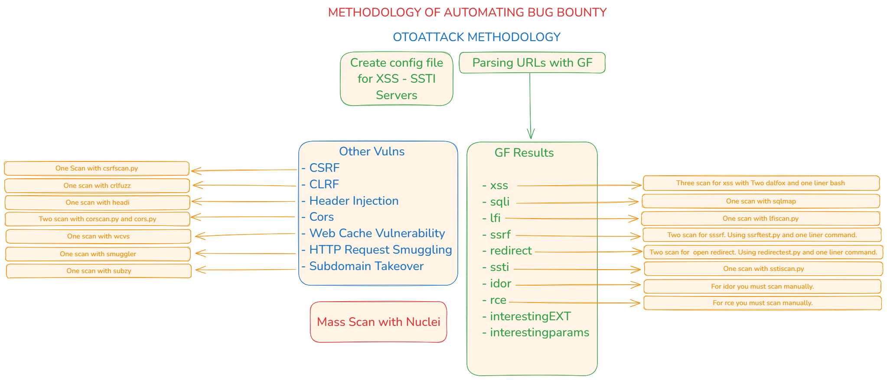

<p align="center">
  <b>Otoattack - Vulnerability Scanner</b>
  <br>
  <b>
    &mdash; Via, <a href="https://github.com/Mr0Wido">Mr0Wido</a>
  </b>
</p>
<p align="center">
    <a href="https://docs.python.org/3/download.html">
        
    </a>
    <a href="https://github.com/Mr0Wido/otoattack/releases">
        
    </a>
    <a href="https://github.com/Mr0Wido/otoattack/">
        
    </a>
    <a href="https://github.com/Mr0Wido/otoattack">
        
    </a>
    <a href="https://mr0wido.github.io"> 
        
    </a>
</p>


## About

Otoattack is a Python-based tool for __Vulnerability Scan__. I wrote much more detail for detecting bugs in my blog. You can read it [here](https://mr0wido.github.io/otoattack). 

Otoattack provides a variety of vuln scan, including these;

- XSS
- SQLi
- SSRF
- Open Redirect
- LFI
- CSRF
- CRLF
- SSTI
- Header Injection
- Cors
- Web Cache Vulnerability
- HTTP Request Smuggling
- Subdomain Takeover
- Nuclei Scan

<br>

## Installation

If you are using a virtual environment, run these commands:

```bash
$ python3 -m venv venv
$ source venv/bin/activate  
```

```bash
$ git clone https://github.com/Mr0Wido/otoattack.git
$ cd otoattack
$ pip install .
```

Run these commands for installing tools:

```bash
$ sudo chmod +x install.sh
$ ./install.sh
```


## Options
There are three option and they required.
**Flags** |    | Description
--- | ---  | ---
-l | --list | Path to the list of targets
-d | --domain | Domain to scan
-scan |  | Scan for the detecting vuln
-config | | Create the config file

## Usage
Provide Servers for XSS and SSTI
```bash
$ python3 otoattack -config
```


```bash
$ python3 otoattack.py -l url.txt -d example.com -scan
```


## Otoattack Workflow

